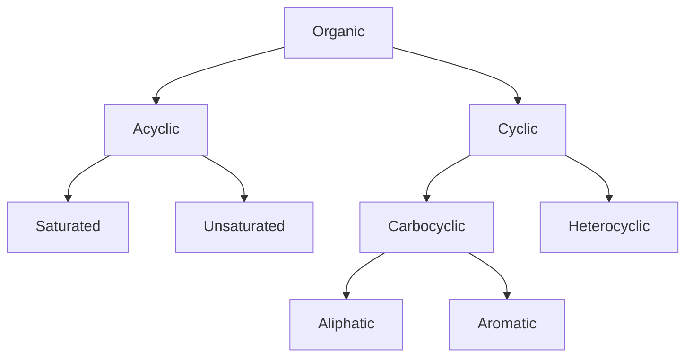

# Organic Chemistry

The atom of Carbon (C, N-6) in organic bonds is always present in an exited state with a valency of 4. Thus, in organic chemistry, Carbon forms 4 covalent bonds, giving off 4 unpaired electrons in its outer shell. In organic chemistry the elements carbon forms bonds with is most other carbon atoms. Due to this, organic chemistry is the study of carbon chains of various length in which remaining vacant Carbon bonds are often taken up by Hydrogen (H, N-1) or functional groups.

## Compound Classification
Depending on the nature of the Carbon chain (ie. depending on the shape of the Carbon skeleton) all organic bonds can be classed as *cyclic* or *acyclic*:

### Fig. 1

- *Acyclic* molecules also known as  *open-chain* carbon chains can be further classified as *saturated*  or *unsaturated*:
  - Saturated molecules have singular bond between its carbon atom on both ends (ie. $\ce{CH3\bond{-}CH2\bond{-}CH3}$ - Propane)
  - Unsaturated molecules have unsaturated (double '$\ce{\bond{=}}$') bonds (ie. $\ce{CH2\bond{=}CH\bond{-}CH3}$ - Propene)
- *Cyclic* molecules can be classified into *carbocyclic* and *heterocyclic*:
  - Within carbocyclic molecules carbon forms a remaining
  - Heterocyclic molecules are the same as carbocyclic but atoms of other elements, such as oxygen or nitrogen, are present in the carbon.
- Lastly, carbocyclic molecules can be classified into *aliphatic* and *aromatic*:
  - Aliphatic molecules are the same have saturated bonds, meaning no double bonds are present
  - Aromatic molecules contain a singular or multiple benzol rings $\ce{C6H6}$.

## Importance of naming
In non-organic chemistry a singular formula defines a singular element ie. $\ce{KOH -> [K]+ [OH]-}$, meaning a molecule containing one atom of Potassium, Oxygen and Hydrogen will always be Potassium Hydroxide. However, in organic chemistry, on top of that general rule is another of isomerism. *Isomers* are elements which have different molecules with the same chemical make-up, they thus also have different chemical properties. In isomers a differing chain of covalent bonds is present between identical sets of elements. For example, $\ce{C2H6O}$ can either be $\ce{CH3\bond{-}CH2\bond{-}OH}$ - ethanol or $\ce{CH3\bond{-}O\bond{-}CH3}$ - dimethyl ether. Thus, it is important to to add a universally accepted name to the formula, IUPAC outlines rules for naming a molecule to outline its elements and structure. The nomenclature names some organic elements as a base and others as *substituent*. It is important to remember some important nomenclature terms:
- Functional group (Also know as the homologous series) - This determines the characteristics of a compound. The functional group along with its carbon chain forms a base. The functional group name is included in the base name in either a suffix or prefix form (see Fig. 2). If a molecule contains multiple functional groups, then the most senior is included in the base name. Fig. 2 contains some of the functional group ranked in their order of superiority. 
- Radical structure - The longest continuous carbon chain which includes the senior of functional groups present in the organic structure.

### <figcaption>Fig. 2<figcaption>
<figure align="center">
    
</figure>

## Naming compounds
The enumeration of a carbon chain starts at whichever end the functional group is. 
Naming a compound in accordance to IUPAC:
1. Determine initial structure (longest carbon chain) and enumerate it
2. Base of the name is determined in the structure outlines above, ie, if it is 4 then the base is *but*
3. Add an appropriate suffix of abundance to the base if double bonds between carbon atoms are present. If multiple are present then their amount is included in the suffix (eg. -dien) and after the suffix their numbered position is included eg. 
$\ce{^{5}CH3\bond{-}^{4}CH\bond{=}^{3}CH\bond{-}^{2}CH\bond{=}^{1}CH2}$ - Pentadien-1,3
4. After the abundance suffix goes the functional group suffix
5. All other substituents are included in the form of prefixes, before each prefix a number is included, showing its position. If multiple identical substituents are present, it is reflected in the name of the suffix (eg. -chlor, -trichlor). If multiple different 
substituents are present they are listed in alphabetical order
6. All numbers in the name are separated from each-other by commas and dashes from words. 

## Different Formulas and their distinctions.
To illustrate the differences between the various formulae Butan-1-ol ($\ce{C4H9OH}$) will be used as an example.
- General formula - formula of the homologous series which describes any member of the series. Eg, $\ce{C_nH_{2n+1}OH}$
- Empirical formula - The simplest whole number ration of elements in the molecule. Eg, $\ce{C4H10O}$
- Molecular formula - $\ce{C_xH_yO_z}$ - the action amount of elements in molecule, can be identical to the empirical formula. Eg, $\ce{C4H10O}$
- Structural formula - shows the arrangement of carbon atoms in the chain along with their functional groups. Eg, $\ce{CH3CH2CH2CH2HOH}$
- Skeletal formula - show the form of the carbon skeleton with its functional groups. Carbon and oxygen atoms are not shown, only implied on the end of each bond. The skeletal formula also shows the angles at which carbon atoms and substituents.(
As the carbon atom in the excited state (IV) contains, on the outer shell, one S- and three P- electrons, which have different energy stores, for covalent bonds to form, hybridisation of S- and P- orbitals must occur. For bonds which create singular (saturated) bonds $SP_3-$ hybridisation occurs for all atoms starting from the second period. The hydrogen atom only contains one S orbital - so it does not hybridise. During $SP3-$ hybridisation one S and three P orbitals become 4 SP- orbitals which all have the same energy store capacity: 

Due to the overlap of SP- hybridised orbitals in metals starting from the second period and S- orbitals of hydrogen, $\sigma$ (sigma) bonds are formed, covalent bonds with the bond strength ~ 400 K joules/mole:

For all 4 $\sigma-$ (SP-) carbon bonds to be equal they need to be at equal angles from the carbon atom. Geometrically it is achieved if carbon is in the middle of a tetrahedral and from the center to the tips are 4 bonds each at a 109.28° angle to each-other. This means that all carbon atoms in saturated acids are in SP3- hybridisation. Eg. carbon atoms in butan-1-ol bonds in the following way:

The distance between neighbouring carbon atoms is 0.154 nm (C-C), with valency angles -109.28° between. The distance between atoms placed with one in between eg. $C_1-C_3$,$C_2-C_4$ in butan-1-ol is 0.25nm.
)
- Display formula - Shows how all atoms are placed within a molecule. Eg.

### Multiple covalent bonds

Extra (multiple) covalent bonds between non-metals in compounds are formed through the overlap of non-hybridised P- orbitals overlapping on a plane perpendicular to the first $\Sigma$ bond. Forming an extra (multiple) $\Pi$

